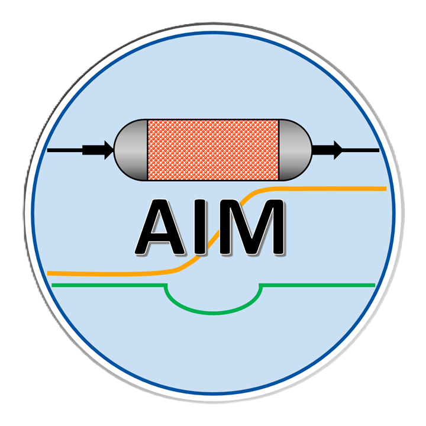

<p align="center">
  
</p>

<h1 align="center">AIM</h1>

<p align="center">
  MATLAB applications for adsorption isotherm analysis and fixed-bed breakthrough simulation.
</p>

<p align="center">
  <a href="https://github.com/Chung-Research-Group/AIM/actions/workflows/pr-checks.yml"></a>
  <a href="https://doi.org/10.1016/j.cpc.2025.109944"></a>
  <a href="LICENSE"></a>
</p>

AIM (Adsorption Integrated Modules) is an open-source suite of MATLAB graphical applications developed by the [Chung Research Group](https://sites.google.com/view/mtap-lab) at Pusan National University. It connects the main stages of an adsorption workflow: fitting pure-component isotherms, estimating isosteric heat, predicting mixture adsorption, and simulating multicomponent fixed-bed breakthrough.

## Modules

| Module | Purpose | Selected capabilities |
| --- | --- | --- |
| **IsoFit** | Fit pure-component adsorption isotherms | Langmuir-family, BET, Sips, Toth, Temkin, Dubinin–Astakhov, Klotz, Do–Do, and related models |
| **HeatFit** | Estimate isosteric heat from multi-temperature data | Clausius–Clapeyron and virial methods |
| **MixPred** | Predict mixture adsorption equilibria | Extended dual-site Langmuir (EDSL) and ideal adsorbed solution theory (IAST) |
| **BreakLab** | Simulate fixed-bed breakthrough | Up to five components, axial dispersion, linear driving force kinetics, pressure drop, and nonisothermal operation |

All modules provide graphical data import, model or simulation selection, interactive plots, and export of results and figures.

## Get started

### Windows standalone application

1. Download [`bin/AIM_Installer_v_1.0.exe`](bin/AIM_Installer_v_1.0.exe).
2. Run the installer and follow its prompts.
3. Install the matching MATLAB Runtime when prompted. A MATLAB license is not required to run the compiled application.

The bundled installer is Windows-only. Treat executables downloaded from GitHub with the same care as any third-party binary and verify that this repository is the source.

### Run from source

Running the application from source requires MATLAB R2024a or newer.

```bash
git clone https://github.com/Chung-Research-Group/AIM.git
cd AIM
```

Open `AIM_Build.prj` in MATLAB, then run `Main_app.mlapp` from the `src` directory. Building a redistributable standalone application additionally requires MATLAB Compiler; see [the build guide](build/README.md).

## Example data

Reproducibility inputs used in the associated publication are in [`manuscript_data`](manuscript_data/README.md). They include IsoFit and HeatFit datasets, saved isotherm parameters, mixture-prediction inputs, and BreakLab case configurations.

## Development and validation

The supported development baseline is MATLAB R2024a or newer. From the repository root, run:

```matlab
buildtool check
buildtool test
```

Pull requests run repository hygiene checks, MATLAB Code Analyzer on R2024a/Linux, and numerical tests on both R2024a/Linux and the latest MATLAB release/Windows. Reports include static-analysis, JUnit, and coverage artifacts. See the [CI policy](.github/CI.md) for the merge gate and exact checks.

Documentation is built with Sphinx and Read the Docs:

```bash
python -m pip install -r docs/requirements.txt
sphinx-build -W --keep-going -b html docs/source docs/_build/html
```

## Documentation and support

- [User documentation](https://chung-research-group.github.io/AIM/)
- [Report a bug or request a feature](https://github.com/Chung-Research-Group/AIM/issues)
- Maintainer: [Muhammad Hassan](https://github.com/hassan-azizi)

When reporting a numerical issue, include the AIM module, MATLAB or Runtime version, operating system, input files, and the smallest reproducible case that demonstrates the problem.

## Citation

If AIM contributes to published work, cite:

> M. Hassan et al., “AIM: A user-friendly GUI workflow program for isotherm fitting, mixture prediction, isosteric heat of adsorption estimation, and breakthrough simulation,” *Computer Physics Communications* **319** (2026), 109944. https://doi.org/10.1016/j.cpc.2025.109944

Machine-readable citation metadata is available in [`CITATION.cff`](CITATION.cff).

## License

AIM is distributed under the [GNU General Public License v2.0](LICENSE).
