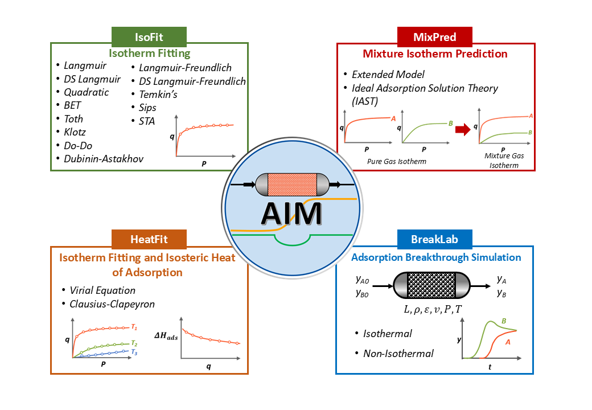

Module workflow
===============

AIM's four modules exchange human-readable data files so a fitted equilibrium
model can move directly into mixture prediction and process simulation.

.. grid:: 1 2 2 2
   :gutter: 3

   .. grid-item-card:: 1. Fit equilibrium data
      :link: isofit
      :link-type: doc

      **IsoFit** estimates parameters from a single-temperature isotherm.

   .. grid-item-card:: 2. Add temperature dependence
      :link: heatfit
      :link-type: doc

      **HeatFit** fits multi-temperature data and isosteric heat.

   .. grid-item-card:: 3. Predict mixtures
      :link: mixpred
      :link-type: doc

      **MixPred** applies EDSL or IAST to pure-component models.

   .. grid-item-card:: 4. Simulate the bed
      :link: breaklab
      :link-type: doc

      **BreakLab** couples equilibrium, kinetics, transport, pressure drop, and
      energy balances.

The :doc:`input-output` guide defines the shared file formats and metadata. The
:doc:`tutorials` page provides a complete video for each module.
